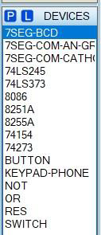
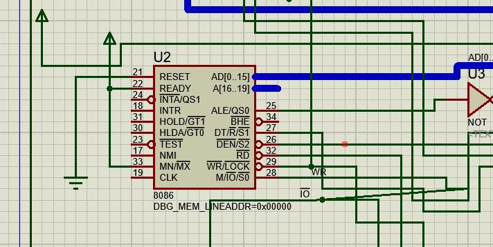
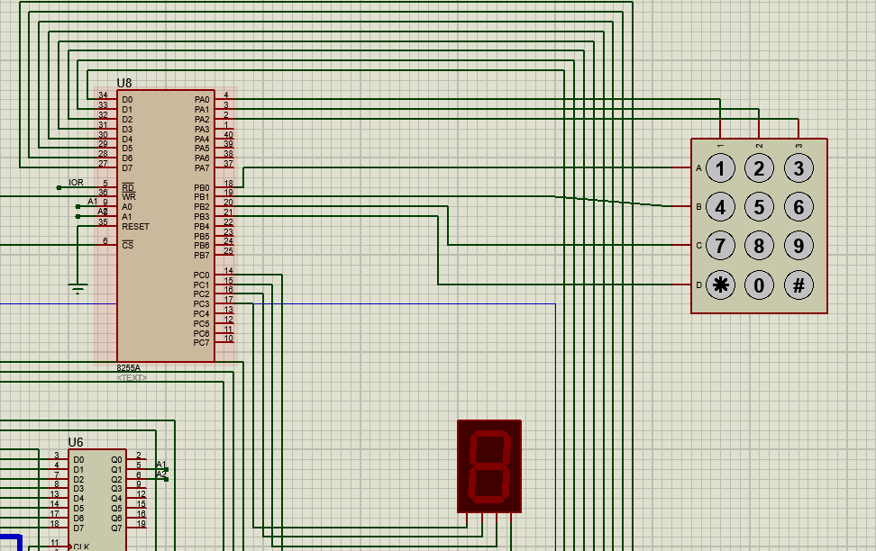
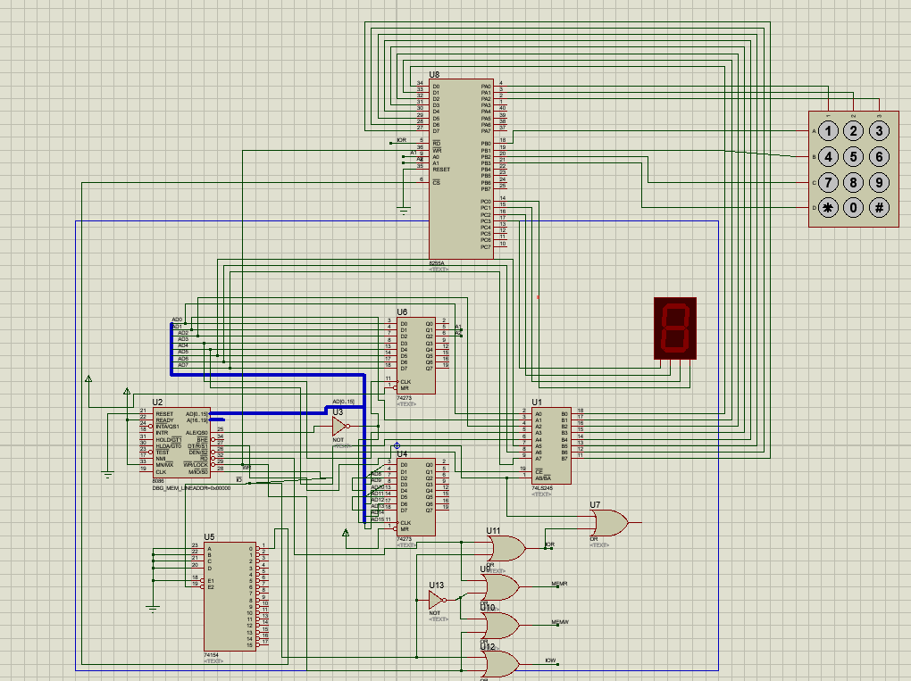

# 7 Segment Display

The assignment involves designing a **simulation** that displays the pushed keys on the screen. I employed the subsequent tools:

- 8086 Microprocessor
- 2 74273 LATCHES for address
- 3X4 KEYPAD
- 74LS245 DATA BUFFER for data transiving
- 8255A for I/OK
- 2 INVERTOR
- 2(8K) ROM
- 2(8K) RAM
- CLOCK GENERATOR CIRCUIT
- 4 OR GATES

 **Proteus software** and **emu8086** were used to construct the program files and project. Installing them is necessary in order to run the files.

## Screenshots

## Using & Run 

Clone the project

*Select the same option and setting to carry out the project after watching the ***explanation video***.

- Load the `8086_Memory.exe.asm} file into emu8086. Use the ***.exe*** file format to save assembly files on emu8086.

- Import the project file named "7 segment display(17-155-014).pdsprj" into Proteus Software.

- Click the 8086 program, choose the Proteus software's "Edit Component" option, open the prior ***.exe*** file, and click ***OK***.

- Next, in Proteus Software, click the ***start*** button on the project diagram.

- The numbers can be altered using the {KEYPAD} section.

As soon as the application runs and numbers are pressed, they appear on the screen.

